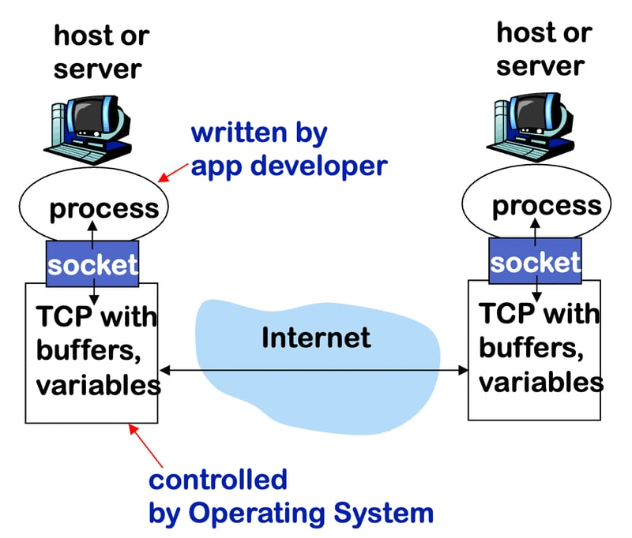
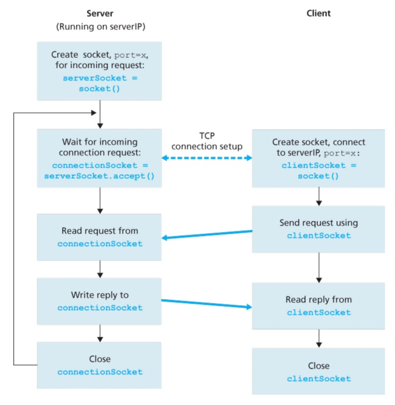

## 如何使用 C 语言编写一个简单的 HTTP 服务器

你可能会想知道网络服务器是如何“提供”文件的，以及它们如何传递组成网站的文件，以便在你的屏幕上显示。了解网络服务器的实现确实是“通过构建学习”的一种好方法。

尽管用C语言实现一个网络服务器听起来非常基础，并且在底层细节上很复杂，但这可能有助于你更好地理解HTTP是如何工作的，以及服务器是如何与客户端互动的。让我们开始吧！

### Socket 是如何工作的

在构建网络服务器之前，你需要了解“套接字”(Socket)是如何工作的。

如果在主机上运行的程序（或进程）就像一座房子，那么套接字就像一扇门，允许邮件进出。当房子里的人接收或发送信件时，他或她可以不关心外界邮件是如何送达的。



通过使用套接字网络接口，我们的网络服务器可以使用C标准库中的一组函数 `<sys/socket.h>`，使我们的服务器能够通过互联网与客户端“对话”。这些客户端也在使用套接字与我们进行通信，因此套接字基本上就像是一个关于如何在互联网上互相交流的共识。



### 创建Server Socket

为了开始，我首先为服务器创建并配置了一个套接字。我配置了一些参数：

- AF_INET：使用IPv4（与IPv6相比）
- SOCK_STREAM：使用TCP（与UDP相比）
- INADDR_ANY：服务器接受来自任何网络接口的连接

```c
int server_fd;
struct sockaddr_in server_addr;

// create server socket
if ((server_fd = socket(AF_INET, SOCK_STREAM, 0)) < 0) {
    perror("socket failed");
    exit(EXIT_FAILURE);
}

// config socket
server_addr.sin_family = AF_INET;
server_addr.sin_addr.s_addr = INADDR_ANY;
server_addr.sin_port = htons(PORT);

// bind socket to port
if (bind(server_fd,
        (struct sockaddr *)&server_addr,
        sizeof(server_addr)) < 0) {
   perror("bind failed");
   exit(EXIT_FAILURE);
}

// listen for connections
if (listen(server_fd, 10) < 0) {
    perror("listen failed");
    exit(EXIT_FAILURE);
}
```
