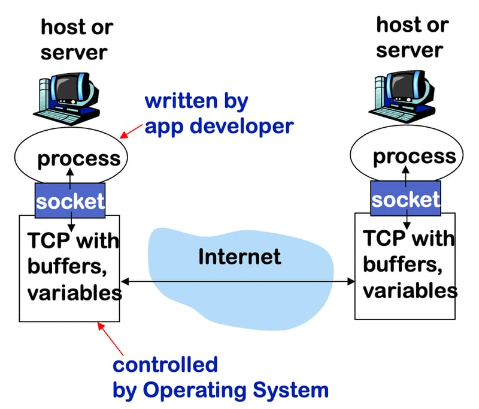
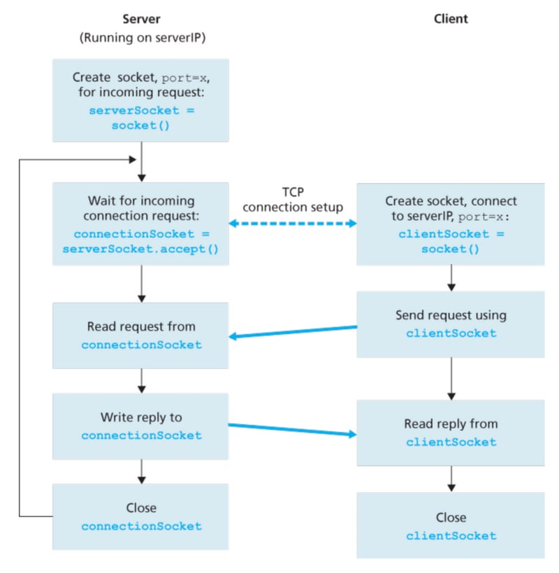
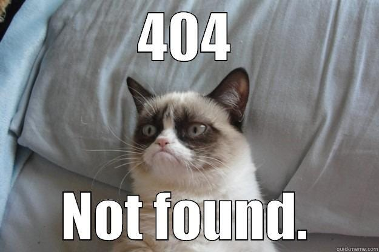

## 如何使用 C 语言编写一个简单的 HTTP 服务器

> 代码位置在本仓库的`simple-http-server`文件夹

你可能会想知道网络服务器是如何“提供”文件的，以及它们如何传递组成网站的文件，以便在你的屏幕上显示。了解网络服务器的实现确实是“通过构建学习”的一种好方法。

尽管用C语言实现一个网络服务器听起来非常基础，并且在底层细节上很复杂，但这可能有助于你更好地理解HTTP是如何工作的，以及服务器是如何与客户端互动的。让我们开始吧！

### Socket 是如何工作的

在构建网络服务器之前，你需要了解“套接字”(Socket)是如何工作的。

如果在主机上运行的程序（或进程）就像一座房子，那么套接字就像一扇门，允许邮件进出。当房子里的人接收或发送信件时，他或她可以不关心外界邮件是如何送达的。



通过使用套接字网络接口，我们的网络服务器可以使用C标准库中的一组函数 `<sys/socket.h>`，使我们的服务器能够通过互联网与客户端“对话”。这些客户端也在使用套接字与我们进行通信，因此套接字基本上就像是一个关于如何在互联网上互相交流的共识。



### 创建Server Socket

为了开始，我首先为服务器创建并配置了一个套接字。我配置了一些参数：

- AF_INET：使用IPv4（与IPv6相比）
- SOCK_STREAM：使用TCP（与UDP相比）
- INADDR_ANY：服务器接受来自任何网络接口的连接

```c
int server_fd;
struct sockaddr_in server_addr;

// create server socket
if ((server_fd = socket(AF_INET, SOCK_STREAM, 0)) < 0) {
    perror("socket failed");
    exit(EXIT_FAILURE);
}

// config socket
server_addr.sin_family = AF_INET;
server_addr.sin_addr.s_addr = INADDR_ANY;
server_addr.sin_port = htons(PORT);

// bind socket to port
if (bind(server_fd,
        (struct sockaddr *)&server_addr,
        sizeof(server_addr)) < 0) {
   perror("bind failed");
   exit(EXIT_FAILURE);
}

// listen for connections
if (listen(server_fd, 10) < 0) {
    perror("listen failed");
    exit(EXIT_FAILURE);
}
```

`bind()` 函数将套接字绑定到一个端口（我在这里使用的是8080），这意味着套接字将监听任何试图连接到8080端口的客户端。`listen()` 函数接受最大待处理连接数（我将其设置为10）。

现在，我的服务器已经设置完毕，准备接受来自客户端的连接。

### 处理客户端连接（Handle Client Connections）

服务器启动并运行后，下一步是处理客户端连接。我使用了一个无限循环来持续监听新的客户端。

当一个客户端连接时，服务器接受该连接并创建一个新线程来处理客户端的HTTP请求。这样，服务器就可以并发处理多个客户端。

```c
while (1) {
    // client info
    struct sockaddr_in client_addr;
    socklen_t client_addr_len = sizeof(client_addr);
    int *client_fd = malloc(sizeof(int));

    // accept client connection
    if ((*client_fd = accept(server_fd,
                            (struct sockaddr *)&client_addr,
                            &client_addr_len)) < 0) {
        perror("accept failed");
        continue;
    }

    // create a new thread to handle client request
    pthread_t thread_id;
    pthread_create(&thread_id, NULL, handle_client, (void *)client_fd);
    pthread_detach(thread_id);
}
```

我定义了一个函数 `handle_client()`，用于处理来自客户端的请求。我只实现了 `GET` 方法，因为它很好地展示了服务器如何“提供”文件给客户端。

`handle_client()` 接收请求数据，提取请求的文件名，并解码 URL（例如，将 `%20` 转换为空格）。然后，它识别文件扩展名，构建一个包含请求文件的HTTP响应，并将其发送回客户端。

```c
void *handle_client(void *arg) {
    int client_fd = *((int *)arg);
    char *buffer = (char *)malloc(BUFFER_SIZE * sizeof(char));

    // receive request data from client and store into buffer
    ssize_t bytes_received = recv(client_fd, buffer, BUFFER_SIZE, 0);
    if (bytes_received > 0) {
        // check if request is GET
        regex_t regex;
        regcomp(&regex, "^GET /([^ ]*) HTTP/1", REG_EXTENDED);
        regmatch_t matches[2];

        if (regexec(&regex, buffer, 2, matches, 0) == 0) {
            // extract filename from request and decode URL
            buffer[matches[1].rm_eo] = '\0';
            const char *url_encoded_file_name = buffer + matches[1].rm_so;
            char *file_name = url_decode(url_encoded_file_name);

            // get file extension
            char file_ext[32];
            strcpy(file_ext, get_file_extension(file_name));

            // build HTTP response
            char *response = (char *)malloc(BUFFER_SIZE * 2 * sizeof(char));
            size_t response_len;
            build_http_response(file_name, file_ext, response, &response_len);

            // send HTTP response to client
            send(client_fd, response, response_len, 0);

            free(response);
            free(file_name);
        }
        regfree(&regex);
    }
    close(client_fd);
    free(arg);
    free(buffer);
    return NULL;
}
```

### 构建HTTP响应（Build HTTP Response）

该函数首先根据文件扩展名构建一个带有适当 MIME 类型的 HTTP 头（例如，如果请求的是 `.jpg` 文件，MIME 类型为 `image/jpeg`）。如果文件不存在，函数会创建一个 `404 Not Found` 响应。否则，它会获取文件的大小，并将 `200 OK` 头添加到响应缓冲区中。



接下来，它读取文件内容并将其附加到响应缓冲区中。返回给 `handle_client()` 的响应缓冲区会被发送回客户端。我将 `BUFFER_SIZE` 设置为 1MB，这意味着服务器可以处理大小最多为 1MB 的任何 HTTP 响应。

## 使用esp32实现一个简单的HTTP服务器

> 源码位置在：`examples/protocols/http_server/simple`

我们还是来实现一个简单的 GET 请求的 HTTP 服务器

具体代码见本仓库的`esp32-simple-http-server`

## 使用ESP32实现采集麦克风声音并播放的功能

麦克风本质上是一种传感器，将声音这种模拟信号以一定的采样率转换成数字信号。

### 采样率

采样率（也称为采样速度或者采样频率）定义了每秒从连续信号中提取并组成离散信号的采样个数，它用赫兹（Hz）来表示。采样频率的倒数叫作采样周期或采样时间，它是采样之间的时间间隔。注意不要将采样率与比特率（bit rate，亦称“位速率”）相混淆。

采样定理表明采样频率必须大于被采样信号带宽的两倍，另外一种等同的说法是奈奎斯特频率必须大于被采样信号的带宽。如果信号的带宽是 100Hz，那么为了避免混叠现象采样频率必须大于200Hz。换句话说就是采样频率必须至少是信号中最大频率分量频率的两倍，否则就不能从信号采样中恢复原始信号。

对于语音采样：

- 8,000 Hz - 电话所用采样率, 对于人的说话已经足够
- 22,050 Hz - 无线电广播所用采样率
- 32,000 Hz - miniDV 数码视频 camcorder、DAT (LP mode)所用采样率
- 44,100 Hz - 音频 CD, 也常用于 MPEG-1 音频（VCD, SVCD, MP3）所用采样率
- 47,250 Hz - Nippon Columbia (Denon)开发的世界上第一个商用 PCM 录音机所用采样率
- 48,000 Hz - miniDV、数字电视、DVD、DAT、电影和专业音频所用的数字声音所用采样率
- 50,000 Hz - 二十世纪七十年代后期出现的 3M 和 Soundstream 开发的第一款商用数字录音机所用采样率
- 50,400 Hz - 三菱 X-80 数字录音机所用所用采样率
- 96,000 或者 192,000 Hz - DVD-Audio、一些 LPCM DVD 音轨、Blu-ray Disc（蓝光盘）音轨、和 HD-DVD （高清晰度 DVD）音轨所用所用采样率
- 2.8224 MHz - SACD、 索尼 和 飞利浦 联合开发的称为 Direct Stream Digital 的 1 位 sigma-delta modulation 过程所用采样率。

总之当前声卡常用的采样频率一般为44.1KHz（每秒采集声音样本44.1千次）11KHz、22KHz、和48KHz。采样频率越高，获得的声音文件质量越好，占用存储空间也就越大。

### 采样位数

即采样值或取样值。它是用来衡量声音波动变化的一个参数。在计算机中采样位数一般分为8bit和16bit。

也就是说，每隔一段采样时间采集一个点，那么采样位数的含义是用多少位来表示这个采样点，也就是采样到的点的精度是多少。8位可以表示256种声音，16位可以表示65536种声音。显然，采样精度越高，采样到的声音越准确。但是也越占内存。

### I2S协议

> 源码位置在 `examples/peripherals/i2s/i2s_codec/i2s_es8311`

源码中需要修改的地方，有关I2C和I2S的引脚号需要修改一下。

```c
#define I2C_SCL_IO 1
#define I2C_SDA_IO 0

#define I2S_MCK_IO 3
#define I2S_BCK_IO 2

#define I2S_DO_IO 6
#define I2S_DI_IO 4
```

还有使能引脚需要拉高。在 `app_main` 的最开始处添加以下代码：

```c
gpio_config_t io_conf = {};
io_conf.intr_type = GPIO_INTR_DISABLE;
io_conf.mode = GPIO_MODE_OUTPUT;
io_conf.pin_bit_mask = (1ULL << 46);
gpio_config(&io_conf);
gpio_set_level(46, 1);
```

I2S（Inter-IC Sound，集成电路内置音频总线）是一种同步串行通信协议，通常用于在两个数字音频设备之间传输音频数据。

ESP32 包含 2 个 I2S 外设。通过配置这些外设，可以借助 I2S 驱动来输入和输出采样数据。

标准或 TDM 通信模式下的 I2S 总线包含以下几条线路：

- MCLK：主时钟线。该信号线可选，具体取决于从机，主要用于向 I2S 从机提供参考时钟。
- BCLK：位时钟线。用于数据线的位时钟。
- WS：字（声道）选择线。通常用于识别声道（除 PDM 模式外）。
- DIN/DOUT：串行数据输入/输出线。如果 DIN 和 DOUT 被配置到相同的 GPIO，数据将在内部回环。

每个 I2S 控制器都具备以下功能，可由 I2S 驱动进行配置：

- 可用作系统主机或从机
- 可用作发射器或接收器
- DMA 控制器支持流数据采样，CPU 无需单独复制每个采样数据

每个控制器都支持 RX 或 TX 单工通信。由于 RX 与 TX 通道共用一个时钟，因此只有在两者拥有相同配置时，才可以实现全双工通信。

## 使用两个ESP32实现对讲机功能

我们使用 udp 协议在两个ESP32之间传输数据。

> 源码位置：examples/protocols/sockets/udp_client
> 源码位置：examples/protocols/sockets/udp_server

我们使用 ESP32 的主板作为 udp client 的一方。关键代码如下：

```c
static void udp_client_task(void *args) {
    int addr_family = 0;
    int ip_protocol = 0;

    dest_addr.sin_addr.s_addr = inet_addr(HOST_IP_ADDR);
    dest_addr.sin_family = AF_INET;
    dest_addr.sin_port = htons(PORT);
    addr_family = AF_INET;
    ip_protocol = IPPROTO_IP;

    sock = socket(addr_family, SOCK_DGRAM, ip_protocol);

    struct timeval timeout;
    timeout.tv_sec = 10;
    timeout.tv_usec = 0;
    setsockopt(sock, SOL_SOCKET, SO_RCVTIMEO, &timeout, sizeof timeout);

    uint8_t tx_buffer[1024];
    size_t bytes_read = 0;
    int sock;
    struct sockaddr_in dest_addr;
    struct sockaddr_storage source_addr;
    socklen_t socklen = sizeof(source_addr);
    
    while (1) {
        memset(tx_buffer, 0, 1024);
        i2s_channel_read(rx_handle, tx_buffer, 1024, &bytes_read, 1000);
        sendto(sock, tx_buffer, 1024, 0, (struct sockaddr *)&dest_addr, sizeof(dest_addr));
    }
}
```

ESP32 的副板作为 udp server 来使用。rtos任务如下：

```c
static void udp_server_task(void* arg) {
    uint8_t rx_buffer[1024];
    int addr_family = AF_INET;
    int ip_protocol = 0;
    struct sockaddr_in6 dest_addr;

    struct sockaddr_in *dest_addr_ip4 = (struct sockaddr_in *)&dest_addr;
    dest_addr_ip4->sin_addr.s_addr = htonl(INADDR_ANY);
    dest_addr_ip4->sin_family = AF_INET;
    dest_addr_ip4->sin_port = htons(PORT);
    ip_protocol = IPPROTO_IP;

    int sock = socket(addr_family, SOCK_DGRAM, ip_protocol);

    struct timeval timeout;
    timeout.tv_sec = 10;
    timeout.tv_usec = 0;
    setsockopt(sock, SOL_SOCKET, SO_RCVTIMEO, &timeout, sizeof timeout);

    bind(sock, (struct sockaddr *)&dest_addr, sizeof(dest_addr));

    struct sockaddr_storage source_addr;
    socklen_t socklen = sizeof(source_addr);

    uint8_t rx_buffer[1024];
    size_t bytes_write;
    while (1) {
        recvfrom(sock, rx_buffer, sizeof(rx_buffer) - 1, 0, (struct sockaddr *)&source_addr, &socklen);
        i2s_channel_write(tx_handle, rx_buffer, 1024, &bytes_write, 1000);
    }
}
```

## 使用两个ESP32通过蓝牙进行通信

主板向副板发送通知的关键代码如下

```c
void ble_send_notify_task(void* args) {
    while (1) {
        if (is_connect) {
            esp_ble_gatts_send_indicate(
                gl_profile_tab[PROFILE_A_APP_ID].gatts_if,
                gl_profile_tab[PROFILE_A_APP_ID].conn_id,
                gl_profile_tab[PROFILE_A_APP_ID].char_handle,
                5,
                (uint8_t*)"hello",
                false
            );
        }
        vTaskDelay(1000 / portTICK_PERIOD_MS);
    }
}
```

副板上面直接移植示例代码 `examples/bluetooth/bluedroid/ble/gatt_client` 中的代码即可。

## 使用ESP32实现websocket服务器

> 例程路径：`examples/protocols/http_server/ws_echo_server`

当我们按下主板的按键时，我们说的话经过麦克风的采集变成数字信号，也就是一个数组，然后通过websocket将数组发送到浏览器，然后使用浏览器的api播放接收到的声音数据。

关键代码如下：

```c
// 初始化一个websocket文件描述符
static int ws_fd = 0;
static uint8_t tx_buffer[8192] = {0};
// 通过websocket发送数据的代码
static void ws_async_send(void *arg) {
    size_t bytes_read = 0;
    memset(tx_buffer, 8192, 0);
    // 读取麦克风的声音
    i2s_channel_read(rx_handle, tx_buffer, 8192, &bytes_read, 1000);
    // websocket数据包
    httpd_ws_frame ws_pkt;
    memset(&ws_pkt, 0, sizeof(httpd_ws_frame_t));
    ws_pkt.payload = tx_buffer;
    ws_pkt.len = 8192;
    ws_pkt.type = HTTPD_WS_TYPE_BINARY;

    httpd_ws_send_frame_async(server, ws_fd, &ws_pkt);
}

// rtos任务
static void ws_send_task(void *arg) {
    while (1) {
        // 检测到按下按键
        if (gpio_get_level(45) == 1) {
            // 将websocket发送方法加入到队列中，
            // 实现websocket异步发送功能
            httpd_queue_work(server, ws_async_send, NULL);
        }
        // 延时100ms, 这样可以将时间片空出来，
        // 使得优先级更低的任务可以执行
        vTaskDelay(100 / portTICK_PERIOD_MS);
    }
}
```

但我们不按下按键时，浏览器可以通过麦克风采集声音数据，然后通过websocket将声音数据发送到esp32主板，再使用esp32主板播放接收到的声音数据即可。

这样我们就实现了浏览器和esp32主板的对讲功能。

关键代码如下：

```c
static esp_err_t echo_handler(httpd_req_t *req) {
    size_t bytes_write = 0;
    if (req->method == HTTP_GET) {
        // 当浏览器第一次连接时，会执行以下代码
        // 将文件描述符保存下来
        ws_fd = httpd_req_to_sockfd(req);
        return ESP_OK;
    }
    httpd_ws_frame_t ws_pkt;
    uint8_t *buf = NULL;
    memset(&ws_pkt, 0, sizeof(httpd_ws_frame_t));
    ws_pkt.type = HTTPD_WS_TYPE_BINARY;
    // 先将 max_len = 0 ，这样可以得到接收到的 frame 的长度
    httpd_ws_recv_frame(req, &ws_pkt, 0);
    // 如果接收到了数据
    if (ws_pkt.len) {
        buf = calloc(1, ws_pkt.len);
        ws_pkt.payload = buf;
        // 将 max_len = ws_pkt.len 来获取 frame 的数据 payload
        httpd_ws_recv_frame(req, &ws_pkt, ws_pkt.len);
        if (gpio_get_level(45) == 0) {
            i2s_channel_write(tx_handle, ws_pkt.payload, ws_pkt.len, &bytes_write, 1000);
        }
    }
    free(buf);
    return 0;
}
```

接下来我们看一下浏览器中的代码应该怎么写：

`pcm-player.js`代码如下，用来在浏览器中播放声音数据

```js
function PCMPlayer(option) {
    this.init(option);
}

PCMPlayer.prototype.init = function(option) {
    var defaults = {
        encoding: '16bitInt',
        channels: 1,
        sampleRate: 8000,
        flushingTime: 1000
    };
    this.option = Object.assign({}, defaults, option);
    this.samples = new Float32Array();
    this.flush = this.flush.bind(this);
    this.interval = setInterval(this.flush, this.option.flushingTime);
    this.maxValue = this.getMaxValue();
    this.typedArray = this.getTypedArray();
    this.createContext();
};

PCMPlayer.prototype.getMaxValue = function () {
    var encodings = {
        '8bitInt': 128,
        '16bitInt': 32768,
        '32bitInt': 2147483648,
        '32bitFloat': 1
    }

    return encodings[this.option.encoding] ? encodings[this.option.encoding] : encodings['16bitInt'];
};

PCMPlayer.prototype.getTypedArray = function () {
    var typedArrays = {
        '8bitInt': Int8Array,
        '16bitInt': Int16Array,
        '32bitInt': Int32Array,
        '32bitFloat': Float32Array
    }

    return typedArrays[this.option.encoding] ? typedArrays[this.option.encoding] : typedArrays['16bitInt'];
};

PCMPlayer.prototype.createContext = function() {
    this.audioCtx = new (window.AudioContext || window.webkitAudioContext)();

    // context needs to be resumed on iOS and Safari (or it will stay in "suspended" state)
    this.audioCtx.resume();
    this.audioCtx.onstatechange = () => console.log(this.audioCtx.state);   // if you want to see "Running" state in console and be happy about it
    
    this.gainNode = this.audioCtx.createGain();
    this.gainNode.gain.value = 1;
    this.gainNode.connect(this.audioCtx.destination);
    this.startTime = this.audioCtx.currentTime;
};

PCMPlayer.prototype.isTypedArray = function(data) {
    return (data.byteLength && data.buffer && data.buffer.constructor == ArrayBuffer);
};

PCMPlayer.prototype.feed = function(data) {
    if (!this.isTypedArray(data)) return;
    data = this.getFormatedValue(data);
    var tmp = new Float32Array(this.samples.length + data.length);
    tmp.set(this.samples, 0);
    tmp.set(data, this.samples.length);
    this.samples = tmp;
};

PCMPlayer.prototype.getFormatedValue = function(data) {
    var data = new this.typedArray(data.buffer),
        float32 = new Float32Array(data.length),
        i;

    for (i = 0; i < data.length; i++) {
        float32[i] = data[i] / this.maxValue;
    }
    return float32;
};

PCMPlayer.prototype.volume = function(volume) {
    this.gainNode.gain.value = volume;
};

PCMPlayer.prototype.destroy = function() {
    if (this.interval) {
        clearInterval(this.interval);
    }
    this.samples = null;
    this.audioCtx.close();
    this.audioCtx = null;
};

PCMPlayer.prototype.flush = function() {
    if (!this.samples.length) return;
    var bufferSource = this.audioCtx.createBufferSource(),
        length = this.samples.length / this.option.channels,
        audioBuffer = this.audioCtx.createBuffer(this.option.channels, length, this.option.sampleRate),
        audioData,
        channel,
        offset,
        i,
        decrement;

    for (channel = 0; channel < this.option.channels; channel++) {
        audioData = audioBuffer.getChannelData(channel);
        offset = channel;
        decrement = 50;
        for (i = 0; i < length; i++) {
            audioData[i] = this.samples[offset];
            /* fadein */
            if (i < 50) {
                audioData[i] =  (audioData[i] * i) / 50;
            }
            /* fadeout*/
            if (i >= (length - 51)) {
                audioData[i] =  (audioData[i] * decrement--) / 50;
            }
            offset += this.option.channels;
        }
    }
    
    if (this.startTime < this.audioCtx.currentTime) {
        this.startTime = this.audioCtx.currentTime;
    }
    console.log('start vs current '+this.startTime+' vs '+this.audioCtx.currentTime+' duration: '+audioBuffer.duration);
    bufferSource.buffer = audioBuffer;
    bufferSource.connect(this.gainNode);
    bufferSource.start(this.startTime);
    this.startTime += audioBuffer.duration;
    this.samples = new Float32Array();
};
```

`main.html` 如下：

```html
<html>
    <head>
        <script src='pcm-player.js'></script>
    </head>
    <script>
        // websocket地址
        let websocket_url = 'ws://172.20.10.5:80/ws';
        let bufferSize = 8192,
            AudioContext,
            context,
            processor,
            input,
            globalStream,
            websocket;

        // 初始化浏览器的websocket
        initWebSocket();

        let player = new PCMPlayer({
            encoding: '16bitInt',
            channels: 1,
            sampleRate: 32000,
            flushingTime: 2000
        });

        // 通过浏览器的麦克风api采集声音
        function startRecording() {
            streamStreaming = true;
            AudioContext = window.AudioContext || window.webkitAudioContext;
            context = new AudioContext({
                latencyHint: 'interactive',
            });
            processor = context.createScriptProcessor(bufferSize, 1, 1);
            processor.connect(context.destination);
            context.resume();

            let handleSuccess = function (stream) {
                const sampleRate = stream.getAudioTracks()[0].getSettings().sampleRate;
                console.log(sampleRate);
                globalStream = stream;
                input = context.createMediaStreamSource(stream);
                input.connect(processor);

                processor.onaudioprocess = function (e) {
                    let left = e.inputBuffer.getChannelData(0);
                    let left16 = downsampleBuffer(left, 48000, 32000);
                    websocket.send(left16);
                };
            };

            navigator.mediaDevices.getUserMedia({ audio: true, video: false }).then(handleSuccess);
        }

        // 停止采集声音
        function stopRecording() {
            streamStreaming = false;

            let track = globalStream.getTracks()[0];
            track.stop();

            input.disconnect(processor);
            processor.disconnect(context.destination);
            context.close().then(function () {
                input = null;
                processor = null;
                context = null;
                AudioContext = null;
            });
        }

        // 初始化websocket
        function initWebSocket() {
            websocket = new WebSocket(websocket_url);
            websocket.onopen = function () {
                document.getElementById("webSocketStatus").innerHTML = '已连接';
            };
            websocket.onclose = function (e) {
                document.getElementById("webSocketStatus").innerHTML = '未连接';
            };
            websocket.onmessage = function (e) {
                e.data.arrayBuffer().then(buffer => {
                    player.feed(new Int16Array(buffer));
                });
            };
        }

        function downsampleBuffer(buffer, sampleBuffer, outSampleRate) {
            let sampleRateRatio = sampleRate / outSampleRate;
            let newLength = Math.round(buffer.length / sampleRateRatio);
            let result = new Int16Array(newLength);
            let offsetResult = 0;
            let offsetBuffer = 0;
            while (offsetResult < result.length) {
                let nextOffsetBuffer = Math.round((offsetResult + 1) * sampleRateRatio);
                let accum = 0;
                let count = 0;
                for (let i = offsetBuffer; i < nextOffsetBuffer && i < buffer.length; i++) {
                    accum += buffer[i];
                    count++;
                }

                result[offsetResult] = Math.min(1, accum / count) * 0x7FFF;
                offsetResult++;
                offsetBuffer = nextOffsetBuffer;
            }

            return result.buffer;
        }
    </script>

    <body>
        <button onclick='startRecording()'>开始采集声音</button>
        <button onclick='stopRecording()'>停止采集声音</button>
        <br />
        <div>WebSocket: <span id="webSocketStatus">未连接</span></div>
    </body>
</html>
```
